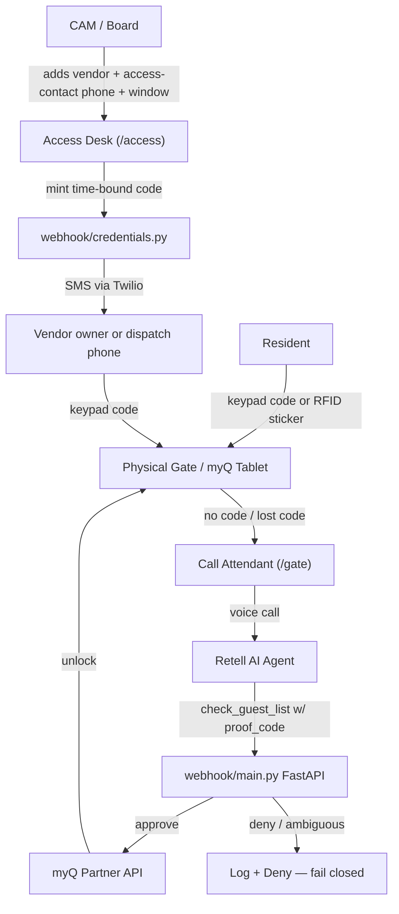

# Project Index Prompt — for Antigravity / other agentic platforms

Copy-paste-ready instructions to hand to Antigravity (or any similar agentic coding
platform) so it can fully understand and index this repo before doing any work in it.

---

## 1. One-sentence context (memorize this first)

> **We Lift** is vendor access for gated HOA/condo communities: the CAM (Community
> Association Manager) approves vendors, We Lift auto-texts them a time-bound gate
> code for the keypad, and an autonomous AI **Call Attendant** (via Retell voice +
> myQ unlock) is only the fallback when someone shows up without a code. Residents
> keep using their existing keypad code / RFID sticker — this product never touches
> resident access.

## 2. Read these 4 files first, in this order — they are the source of truth

1. [`docs/PRODUCT.md`](PRODUCT.md) — refined product thesis, economics, "we are / we are not" table
2. [`docs/pilot-the-inlets/decision-log.md`](pilot-the-inlets/decision-log.md) — every locked product decision (Q1–Q9), with owner/date
3. [`docs/GATE-SECURITY.md`](GATE-SECURITY.md) — authorization vs. authentication model, code hygiene, AI fallback rules
4. [`.cursor/agents/we-lift.md`](../.cursor/agents/we-lift.md) — condensed "hard rules" cheat sheet already written for AI agents working in this repo

Then read [`AGENTS.md`](../AGENTS.md) for how to actually run/test the code.

## 3. Repo map (tell the indexer what each area is)

| Area | What it is | Index priority |
|------|-----------|-----------------|
| `docs/PRODUCT.md`, `docs/GATE-SECURITY.md`, `docs/VENDOR-CONTACTS.md`, `docs/VENDOR-PORTAL.md`, `docs/VENDOR-PORTAL-ROADMAP.md` | Current, locked product design | High |
| `docs/pilot-the-inlets/` | Live pilot playbooks for The Inlets (SWFL), decision log, myQ API path, CAM outreach | High |
| `docs/PRODUCT-ACCEPTANCE.md`, `docs/GATE-CODE-RUNBOOK.md`, `docs/MYQ-TABLET-RETELL.md`, `docs/PILOT-WEEK.md`, `docs/PHASE0-OPS.md`, `docs/SALES-DEMO.md` | Operational/build-out docs for the current Access Desk build | High |
| `webhook/` (`main.py`, `credentials.py`, `static/access.html`, `static/gate.html`) | The **only runnable application** — FastAPI service: CAM Access Desk UI, credential minting/SMS, Retell tool endpoints, myQ unlock | Highest — this is ground truth for actual behavior |
| `prompt.md` + `configs/retell-llm.json` + `configs/retell-agent.json` | The canonical Retell voice-agent prompt/config — must always match `webhook/main.py` logic | Highest |
| `configs/retell-agent-import.json`, `configs/retell-agent-flow.base.json`, `scripts/build_retell_import.py` | Alternate Retell "dashboard Import" (conversation-flow) setup path — **currently has an unreconciled, older prompt draft**, flagged in `docs/PRODUCT.md#retell-build-paths` | Medium — read but treat as secondary to `prompt.md` |
| `scripts/create_agent.py`, `scripts/send_vendor_code.py`, `scripts/wire_demo_stack.py` | Operational scripts (push Retell config via API, send a vendor code, wire the demo stack) | Medium |
| `setup-checklist.md` | Step-by-step Retell + myQ wiring (both setup paths) | Medium |
| `01-metro-validation/`, `02-pilot-math/`, `03-channel-test/`, `04-risk-setup/` | GTM/analyst "launch pack": market map, pilot P&L, CAM outreach kit, insurance/liability — **not runtime code** | Medium |
| `mockups/` | HTML/PNG visual mockups of the myQ tablet UX — reference only | Low |
| `comet-retell-install-brief.md`, `03-channel-test/smith-ai-setup-checklist.md` | **Historical/archived** — Smith.ai is fully dropped; comet brief is superseded | Low / mark as archive |
| `.cursor/agents/we-lift.md` | Prebuilt agent persona/rules for this repo | High (meta) |
| `data/*.example.json`, `data/*.seed.json` | Committed seed/example data | Low, structural only |
| `data/guest-list.json`, `data/vendors.json`, `data/credentials.json`, `webhook/.env`, any `.venv/`, `__pycache__/` | **Gitignored runtime state** — do not index, these are generated locally and never committed | Exclude |

## 4. Architecture / data flow to encode



## 5. Hard invariants — flag any code/doc change that violates these

1. **Autonomous, no human bridge.** No overnight human attendant, no 2am SMS wake to a founder.
2. **Fail closed.** Never call `open_gate` without `check_guest_list` returning `approve` first.
3. **Vendors need `proof_code`.** A company name alone is never enough to open the gate.
4. **Residents are never AI-opened.** Always redirect to keypad/sticker.
5. **Emergencies → 911.** The AI never handles emergencies itself.
6. **Smith.ai is fully retired.** Any Smith.ai reference in the repo is historical/comparison only — production voice is Retell-only.
7. **Three files must stay in sync:** `prompt.md`, `configs/retell-llm.json`, `webhook/main.py`. If one changes behavior, the others must be updated in the same change.

## 6. Known open item (don't silently "fix" it — surface it)

`configs/retell-agent-import.json` / `configs/retell-agent-flow.base.json` (the Retell
dashboard "Import" conversation-flow format) still embed an older prompt draft that
doesn't require `proof_code`, unlike the canonical `prompt.md`. This is documented at
[`docs/PRODUCT.md#retell-build-paths`](PRODUCT.md#retell-build-paths) and in a
"folded-in ideas" note at the bottom of [`prompt.md`](../prompt.md). Treat `prompt.md`
as canonical until a human reconciles this.

## 7. How to run/verify the one real service (for the indexer to validate its own understanding)

```bash
cd webhook
cp .env.example .env
cp ../data/guest-list.example.json ../data/guest-list.json
python3 -m venv .venv && source .venv/bin/activate
pip install -r requirements.txt
./run.sh                      # starts FastAPI on :8080 (SIMULATE_MYQ_OPEN=true for demos)
# in another shell:
python3 test_tools.py         # self-contained smoke suite, prints "ALL WEBHOOKS PASS"
```
